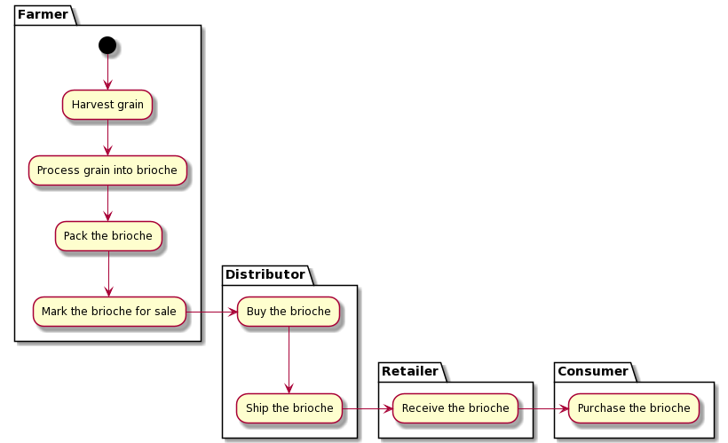
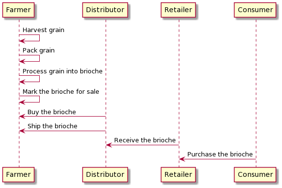
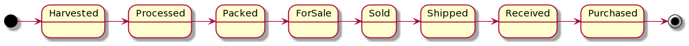
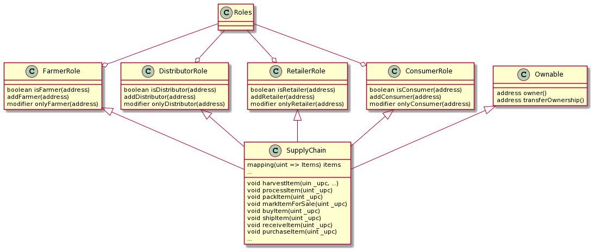

# Ethereum SupplyChain Dapp

[Udacity - Blockchain Developer Nanodegree Program](https://www.udacity.com/course/blockchain-developer-nanodegree--nd1309)

#### Activity Diagram


#### Sequence Diagram


#### State Diagram


#### Classes (Data Model)


### Libraries and Versions
```
- Program version number: 1.0.0 (src/js/app.js)
- Node v15.5.1
- Truffle v5.4.8
- Solidity v0.6.2
- Web3.js v1.3.5
- Ganache CLI v6.12.2 (ganache-core: 2.13.2)
- MetaMask v10.1.0
```

#### Testing

```bash
=> truffle test
Using network 'development'.


Compiling your contracts...
===========================
> Everything is up to date, there is nothing to compile.

ganache-cli accounts used here...
Contract Owner: accounts[0]  0x26708615613250F0D4529c392a4c24dC0e45c046
Farmer: accounts[1]  0xc6d9A96b998cc3e11bf7451c651D17053a835065
Distributor: accounts[2]  0xA146F79d3bfb773e0Af4ff1BAb19b690fF3d8bEa
Retailer: accounts[3]  0xf488b9452c04c01b921D4bD328DBA2E220914DE2
Consumer: accounts[4]  0x5B23d656B16c3f53818E8a539a160C15deB21099


  Contract: SupplyChain
    ✓ Testing smart contract function harvestItem() that allows a farmer to harvest coffee (139ms)
    ✓ Testing smart contract function processItem() that allows a farmer to process coffee (110ms)
    ✓ Testing smart contract function packItem() that allows a farmer to pack coffee (99ms)
    ✓ Testing smart contract function markItemForSale() that allows a farmer to sell coffee (93ms)
    ✓ Testing smart contract function buyItem() that allows a distributor to buy coffee (111ms)
    ✓ Testing smart contract function shipItem() that allows a distributor to ship coffee (80ms)
    ✓ Testing smart contract function receiveItem() that allows a retailer to mark coffee received (80ms)
    ✓ Testing smart contract function purchaseItem() that allows a consumer to purchase coffee (81ms)
    ✓ Testing smart contract function fetchItemBufferOne() that allows anyone to fetch item details from blockchain
    ✓ Testing smart contract function fetchItemBufferTwo() that allows anyone to fetch item details from blockchain


  10 passing (1s)
```


### Rinkeby Network

- contract hash: 0x638d9f7f2d5b040e2b880bdd5e01b72ad2abbf7f357309e7c6a2aefe7d5457e7
- contract address: https://rinkeby.etherscan.io/address/0xe2155e536dfbad9d3ba585764ce088316efdb623

```
FarmerAdded - 0x7fc7dea4d5c2a336e0295f66a6bed1dea706afeaec9b9e834fd9bf29b60f2a8d
DistributorAdded - 0x6279fe7982590337a46ae21c7943f2dd1d30daa4ec2a83582648e0ffc53e27a0
RetailerAdded - 0x14e5d4f965688608b66e48bd45b68bb517cf1d8fc344afb4fd87bbc29db95ba2
ConsumerAdded - 0xdc99b2c38222a81310bd170b9967a85ec80eab503c7e92b7f1972e88e213dce8
Harvested - 0xcbebf4ed47a7592c11901e1b2d180b6c7129eb8a6a68568444554ab216bdfb30
Processed - 0x62aac74b7a60f53dfe6fc09880d0aeb6db6f857616361a98e38e8924118947fc
Packed - 0xccf6aa7d071c4ce330afae59d7e461186ebddd65ec7b75ce11a6e0f572367d63
ForSale - 0xc5ceb5188d7e65059a250d759397f88a073cf0b5f35aec3d9225c480ae16d6a3
Sold - 0x1671473b47d99934e7128301029da1f3480ed17b86ff8f7f3f027def4f49071e
Shipped - 0x5cc5fe9f8072a3973ebb3373a0c130aa30fb9c75b92e2253b17148f353b285ee
Received - 0x18acf62901ffe881a777e1a10ed247b3afb5fe6642445556e7e1833cece9a668
Purchased - 0xa10fe84f7ac35d56494604e9be5fb14db630d0e896e401d621739d7c735c9acc
```
