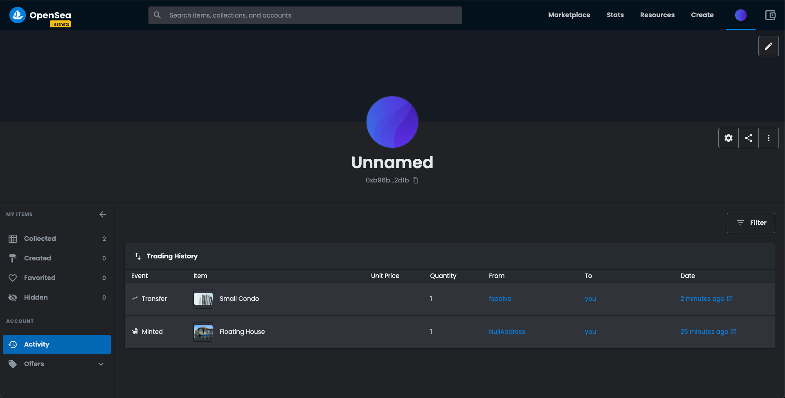
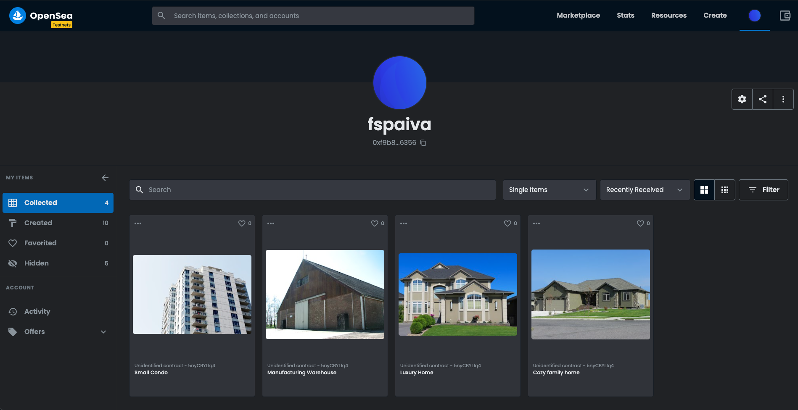
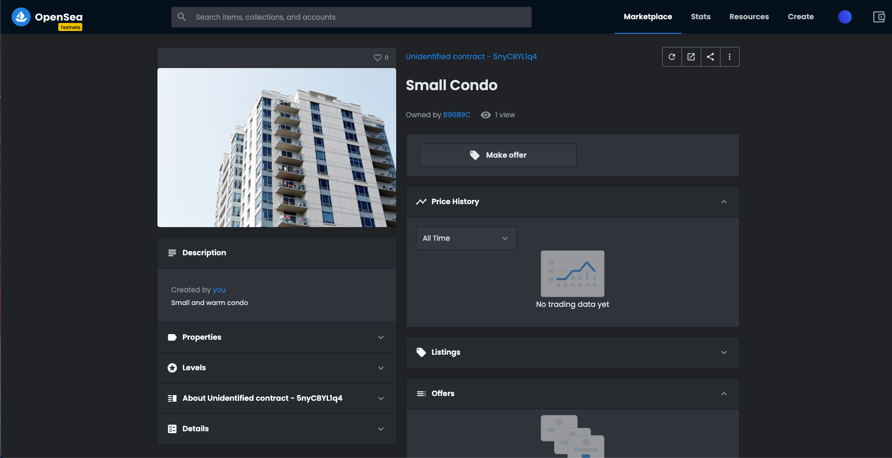

# Ethereum RealEstateMarketplace Dapp

## Install

Compatible with:

* Truffle v5.4.8
* Solidity v0.8.3 (solc-js)
* OpenZeppelin v4.1.0 (solidity: 0.8.0)
* Node v15.5.1
* Web3.js v1.3.6
* Ganache CLI v6.12.2 (ganache-core: 2.13.2)
* Zokrates v0.7.3

Run:

`npm install`

`truffle compile`

## Develop Back-End

### Testing

Start local ethereum blockchain:

`ganache-cli`

To run all tests:

`npm test` or `truffle test`

To run a single test:

- `truffle test ./test/TestSolnSquareVerifier.js`
- `truffle test ./test/TestERC721Mintable.js`
- `truffle test ./test/TestSquareVerifier.js`

### Deployment on Rinkeby

Create in root folder `.rinkeby-infurakey` and `.secret` and run:

`truffle migrate --network rinkeby`

### Deployment info (required for project submission)

- My Rinkeby accounts:
    - contract owner & token seller:
      [0xf9B8DF9C10a3f1B58BBB43d73d0f244a06dF6356](https://rinkeby.etherscan.io/address/0xf9B8DF9C10a3f1B58BBB43d73d0f244a06dF6356)
    - token buyer:
      [0xb96B9Cb6A3f078F761f4dE95bfBd96cF74E92D1b](https://rinkeby.etherscan.io/address/0xb96B9Cb6A3f078F761f4dE95bfBd96cF74E92D1b)
- Contract SquareVerifier:
    - address:
      [0x011eCbdd8D9b42c4bbE2d4Aac3a3202328BAeBe4](https://rinkeby.etherscan.io/address/0x011eCbdd8D9b42c4bbE2d4Aac3a3202328BAeBe4)
- Contract SolnSquareVerifier:
    - address:
      [0xfE263A9CD86DC74d0Fa08A26886D9e6A8de2E971](https://rinkeby.etherscan.io/address/0xfE263A9CD86DC74d0Fa08A26886D9e6A8de2E971)
    - [event's history](https://rinkeby.etherscan.io/address/0xfE263A9CD86DC74d0Fa08A26886D9e6A8de2E971#events)
    - [abi](pareot-contract-abi.json)
    - [deployment log](res/rinkeby-deployment-log.md)

## Develop Front-End

### Token Minting

- Start Brave browser
- Log-in to your [my ether wallet - MEW CX](https://www.myetherwallet.com)
- Change network to Rinkeby Testnet
- Select the contract owner account
- Navigate to [interace with contract](https://www.myetherwallet.com/interface/interact-with-contract)
- Connect to SolnSquareVerifier address and use [this contract abi](pareot-contract-abi.json)
- Mint some tokens

### Front store & minted NFT listed on Open Sea (required for project submission)

Visit the [Front Store](https://testnets.opensea.io/collection/unidentified-contract-5nycbyl1q4) ...

... or select directly one of the tokens:

- [token-1](https://testnets.opensea.io/assets/0xfe263a9cd86dc74d0fa08a26886d9e6a8de2e971/1)
- [token-2](https://testnets.opensea.io/assets/0xfe263a9cd86dc74d0fa08a26886d9e6a8de2e971/2)
- [token-3](https://testnets.opensea.io/assets/0xfe263a9cd86dc74d0fa08a26886d9e6a8de2e971/3)
- [token-4](https://testnets.opensea.io/assets/0xfe263a9cd86dc74d0fa08a26886d9e6a8de2e971/4)
- [token-5](https://testnets.opensea.io/assets/0xfe263a9cd86dc74d0fa08a26886d9e6a8de2e971/5)

### User Interface

