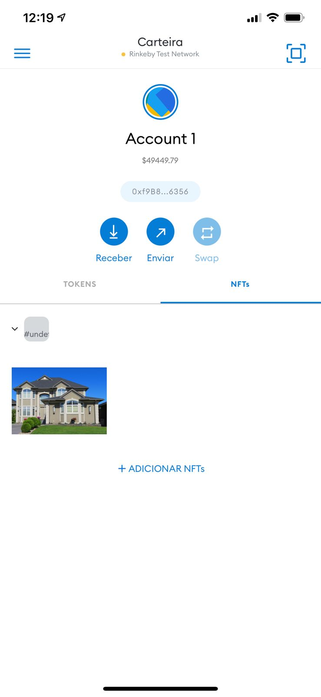

# Ethereum RealEstateMarketplace Dapp

## Install

Compatible with:

* Truffle v5.4.8
* Solidity v0.8.3 (solc-js)
* OpenZeppelin v4.1.0 (solidity: 0.8.0)
* Node v15.5.1
* Web3.js v1.3.6
* Ganache CLI v6.12.2 (ganache-core: 2.13.2)
* Zokrates v0.7.3

Run:

`npm install`

`truffle compile`

## Develop Back-End

### Testing

Start local ethereum blockchain:

`ganache-cli`

To run all tests:

`npm test` or `truffle test`

To run a single test:

- `truffle test ./test/TestSolnSquareVerifier.js`
- `truffle test ./test/TestERC721Mintable.js`
- `truffle test ./test/TestSquareVerifier.js`

### Deployment on Rinkeby

Create in root folder `.rinkeby-infurakey` and `.secret` and run:

`truffle migrate --network rinkeby`

### Deployment info (required for project submission)

- My Rinkeby accounts:
    - contract owner & token seller:
      [0xf9B8DF9C10a3f1B58BBB43d73d0f244a06dF6356](https://rinkeby.etherscan.io/address/0xf9B8DF9C10a3f1B58BBB43d73d0f244a06dF6356)
    - token buyer:
      [0xb96B9Cb6A3f078F761f4dE95bfBd96cF74E92D1b](https://rinkeby.etherscan.io/address/0xb69D653a2cd9D53228fE633B1de11948d5Fb543c)
- Contract SquareVerifier:
    - address:
      [0x011eCbdd8D9b42c4bbE2d4Aac3a3202328BAeBe4](https://rinkeby.etherscan.io/address/0x011eCbdd8D9b42c4bbE2d4Aac3a3202328BAeBe4)
- Contract SolnSquareVerifier:
    - address:
      [0xfE263A9CD86DC74d0Fa08A26886D9e6A8de2E971](https://rinkeby.etherscan.io/address/0x5206e78b21ce315ce284fb24cf05e0585a93b1d9)
    - [event's history](https://rinkeby.etherscan.io/address/0x5206e78b21ce315ce284fb24cf05e0585a93b1d9#events)
    - [abi](pareot-contract-abi.json)
    - [deployment log](res/rinkeby-deployment-log.md)

## Develop Front-End

### Token Minting

- Start Brave browser
- Log-in to your [my ether wallet - MEW CX](https://v5.myetherwallet.com/)
- Change network to Rinkeby Testnet
- Select the contract owner account
- Navigate to [interace with contract](https://v5.myetherwallet.com/interface/interact-with-contract)
- Connect to SolnSquareVerifier address and use [this contract abi](pareot-contract-abi.json)
- Mint some tokens

### Front store & minted NFT listed on Open Sea (required for project submission)

Visit the [Front Store](https://testnets.opensea.io/collection/privacyassuredrealestateownershiptoken) ...

... or select directly one of the tokens:

- [token-1](https://testnets.opensea.io/assets/0x8fd8ed36f6be64d368d3580b88acbf1b67087f97/1)
- [token-1-sell](https://rinkeby.etherscan.io/tx/0x865716bd0f140d8823cc9adb8b8d3c8fc42ef5468d253eab6efc19cdccce183f)

- [token-2](https://testnets.opensea.io/assets/0x8fd8ed36f6be64d368d3580b88acbf1b67087f97/2)
- [token-2-sell](https://rinkeby.etherscan.io/tx/0x7bba6c8ff60317195ab59d47a235a8bace91271a6b0a98a596348aa168dd6016)

- [token-3](https://testnets.opensea.io/assets/0x8fd8ed36f6be64d368d3580b88acbf1b67087f97/3)
- [token-3-sell](https://rinkeby.etherscan.io/tx/0x8e5f577e8cfc8256ddd6b9e5c94764925edc25097b796d29ddbc83f8f8d9f9bd)

- [token-4](https://testnets.opensea.io/assets/0x8fd8ed36f6be64d368d3580b88acbf1b67087f97/4)
- [token-4-sell](https://rinkeby.etherscan.io/tx/0xa3181457a4e5bc32ef5741deda034fa92efb5e29551c2cf0aafe3325818496ae)

- [token-5](https://testnets.opensea.io/assets/0x8fd8ed36f6be64d368d3580b88acbf1b67087f97/5)
- [token-5-sell](https://rinkeby.etherscan.io/tx/0x6e7ee3eb2be51108a5558abb974b5548ca9c66444caee8e8ad1ddd48786b4e3f)

### User Interface

